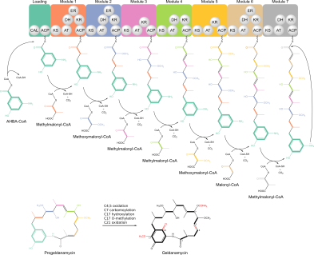
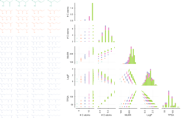
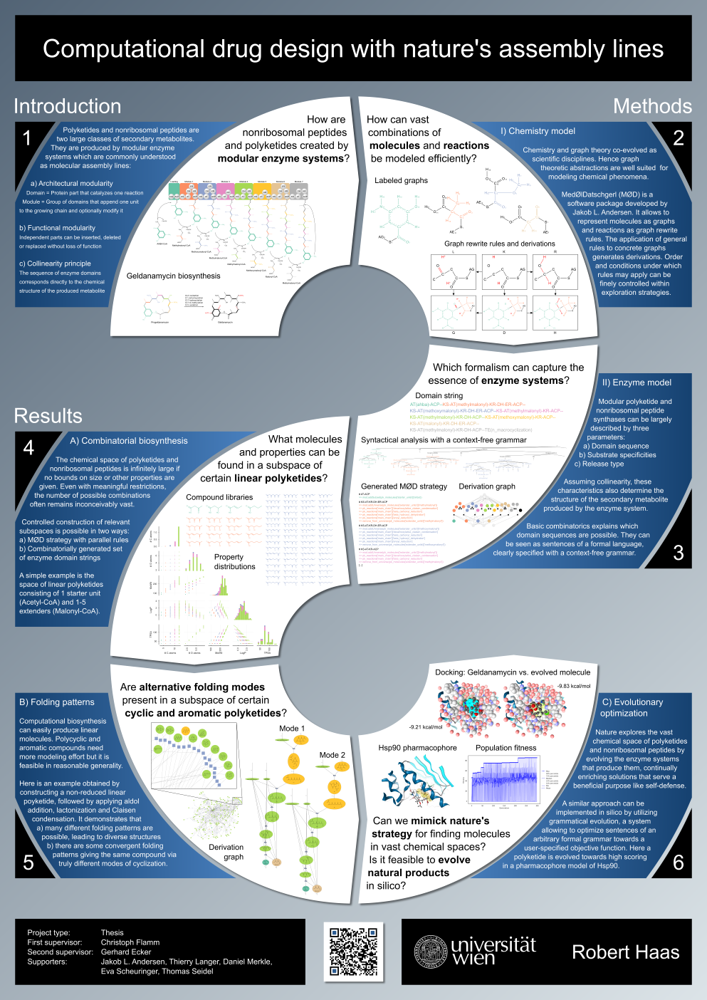

## Panakeia's garden: Computational biosynthesis of secondary metabolites

Welcome! You have found `Panakeia's garden`, an open-source software package for computational biosynthesis of polyketides and nonribosomal peptides.

The primary intent of this project is to strengthen the connection between [metabolic engineering of natural product pathways](http://dx.doi.org/10.1039/C5NP00109A) and [rational drug discovery](http://dx.doi.org/10.1126/science.1168243). The software package allows to systematically explore the vast chemical space of polyketide and nonribosomal peptide biosynthesis. These two major classes of secondary metabolites are the source of many drugs in clinical use, for example [amphotericin](https://en.wikipedia.org/wiki/Amphotericin_B) (antifungal), [doxorubicin](https://en.wikipedia.org/wiki/Doxorubicin) (anticancer), [erythromycin](https://en.wikipedia.org/wiki/Erythromycin) (antibiotic), [ivermectin](https://en.wikipedia.org/wiki/Ivermectin) (antiparasitic), [lovastatin](https://en.wikipedia.org/wiki/Lovastatin) (cholesterol-lowering) and [rapamycin](https://en.wikipedia.org/wiki/Sirolimus) (immunosuppressive). Given a) the inconceivably large size of this chemical space and b) the proven value of contained compounds, it is reasonable to hope that we can find further pharmaceutically relevant molecules in it. Bioengineering provides increasingly sophisticated tools for modifying existing natural product pathways and even building new ones, however, the necessary effort to generate novel secondary metabolites is still considerably large. A computational solution for identifying promising polyketides and nonribosomal peptides might accelerate this endeveaur substantially, hopefully paving the way for the development of new drugs.

## ELRIG Drug Discovery 2017 Conference

### Pre-release software demonstrations

- <a href="https://cdn.rawgit.com/robert-haas/panakeias-garden/aa733a49/prerelease/sites/progeldanamycin/notebook.html"> Construction of geldanamycin </a>
  
  
  
- <a href="https://cdn.rawgit.com/robert-haas/panakeias-garden/aa733a49/prerelease/sites/linear_polyketides/notebook.html"> Generation of a subspace of linear polyketides </a>

  

### Poster

### References

- Introductions to modular enzyme systems
  - Christian Hertweck: <a href="http://dx.doi.org/10.1002/anie.200806121"> The Biosynthetic Logic of Polyketide Diversity </a>
  - Chaitan Khosla: Lecture on polyketide biosynthesis
    <a href="https://www.youtube.com/watch?v=46VGPtEbKYQ">Part 1</a>,
    <a href="https://www.youtube.com/watch?v=SRVbnGKubrU">Part 2</a>,
    <a href="https://www.youtube.com/watch?v=hjXUEqBDxmY">Part 3</a>
  
- Chemical model

  `Panakeia's garden` builds on top of the excellent software package <a href="http://cheminf.imada.sdu.dk/mod/">MedØlDatschgerl</a> developed by Jakob L. Andersen. It allows to encode molecules as graphs, reactions as graph grammars and enables controlled exploration of chemical spaces. You can test it on its <a href="http://cheminf.imada.sdu.dk/mod/playground.html#playground">live playground</a>.
  
- Institutional affiliations
  
  This project is developed as a Master thesis at the University of Vienna. It is supervised by
  - Christoph Flamm, <a href="https://www.tbi.univie.ac.at/"> Theoretical Biochemistry Group </a>
  - Gerhard Ecker, <a href="https://pharminfo.univie.ac.at"> Pharmacoinformatics Research Group </a>

- Poster creation process
  
  The poster for ELRIG DD2017 was inspired by following blog article of Felix Breuer: <a href="http://blog.felixbreuer.net/2010/10/24/poster.html"> Making a Math Conference Poster with Inkscape </a>
